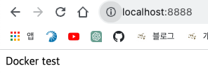

# 도커의 기본 개념과 사용법에 대해 알아보자!

## 이론

### 도커란?

- 컨테이너 기반의 가상화 도구이다.
- 애플리케이션을 컨테이너라는 단위로 격리하여 실행하고 배포할 수 있다.

### 컨테이너란?

- 가상화 기술 중 하나이다.
- 호스트 운영체제 위에 여러 개의 격리된 환경을 생성하는 것이다.

### 가상화란?

- 하나의 물리적인 컴퓨터 자원을 논리적으로 분할하여 여러 개의 가상 컴퓨터 환경을 만들어 내는 기술이다.
- 가상화의 장점
  - 컴퓨터 자원을 효율적으로 사용할 수 있도록 한다.
  - 애플리케이션 운영에 유연함과 안정성을 제공한다.

## 실습

**1. 도커 허브에서 httpd 이미지 가져오기**

```
docker pull httpd
```

**2. 이미지 확인하기**

```
docker images
```

**3. 실행하기**

- 포트 설정 및 파일 마운트를 해야 한다.
- 마운트할 index.html 파일이 있어야 화면이 출력된다.

```
docker run -p 8888:80 -v /Users/gayoung/workspace/docker/docker-wanted-challenge/01-docker-basic:/usr/local/apache2/htdocs httpd
```

**4. 결과 확인**



## Reference

https://github.com/drum-grammer/docker-pro-2308/blob/main/lecture/1st/cli.md
