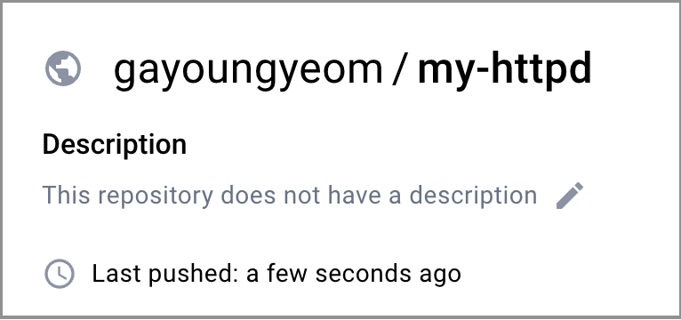

# 로컬 환경에서 도커를 활용해보자!

## Docker Hub에 올리기

1. Dcokerfile 생성
2. 이미지 build
3. 도커 허브의 아이디를 붙여 새로운 태그 생성 (규칙임)
4. 도커 허브에 푸시

```bash
docker build -t my-httpd .
docker image tag my-httpd gayoungyeom/my-httpd:lastest
docker push gayoungyeom/my-httpd
```

쨘!


## Docker Network Driver의 종류

- `bridge`: 동일한 호스트의 다른 컨테이너와 통신할 때 사용하는 네트워크 (default)
- `overlay`: 서로 다른 도커 호스트의 컨테이너 간 통신할 때 사용하는 네트워크
- `host`: 호스트 컴퓨터의 네트워크 인터페이스를 그대로 사용하는 네트워크
- `none`: 네트워크를 사용하지 않는 컨테이너

**종류 확인 명령어**

```
docker network ls
```

**특정 네트워크 상세 확인 명령어**

- 여기서 연결된 컨테이너 목록을 확인할 수 있다.

```
docker network inspect bridge
```

## Docker Compose

여러 개의 컨테이너를 제어해야 한다면? 불편하다. 이때 Docker Compose를 사용하면 된다.

### 도커 컴포즈란?

- 도커 컨테이너를 일괄적으로 정의하고 제어하는 도구
- 설정 파일을 도커 CLI로 번역하는 역할

**docker-compose.yml파일 구성 알아보기**

- `version`: 3.0을 기본으로 사용 (옵션)
- `services`는 실행하려는 컨테이너들을 정의하는 역할 (제일 중요)

**명령어**

```
docker compose -f docker-compose.yml up --build -d
```

- `up`: 도커 컴포즈 파일로 컨테이너 생성
- `-f`: 도커 컴포즈 파일 지정
- `-d`: 백그라운드에서 실행

## Reference

- https://docs.docker.com/network/drivers/
- https://docs.docker.com/compose/
